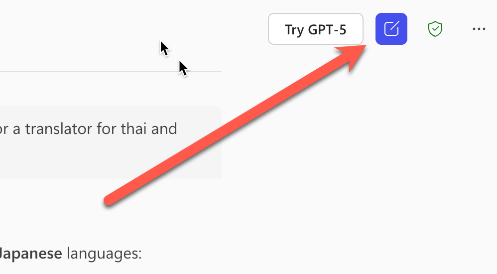
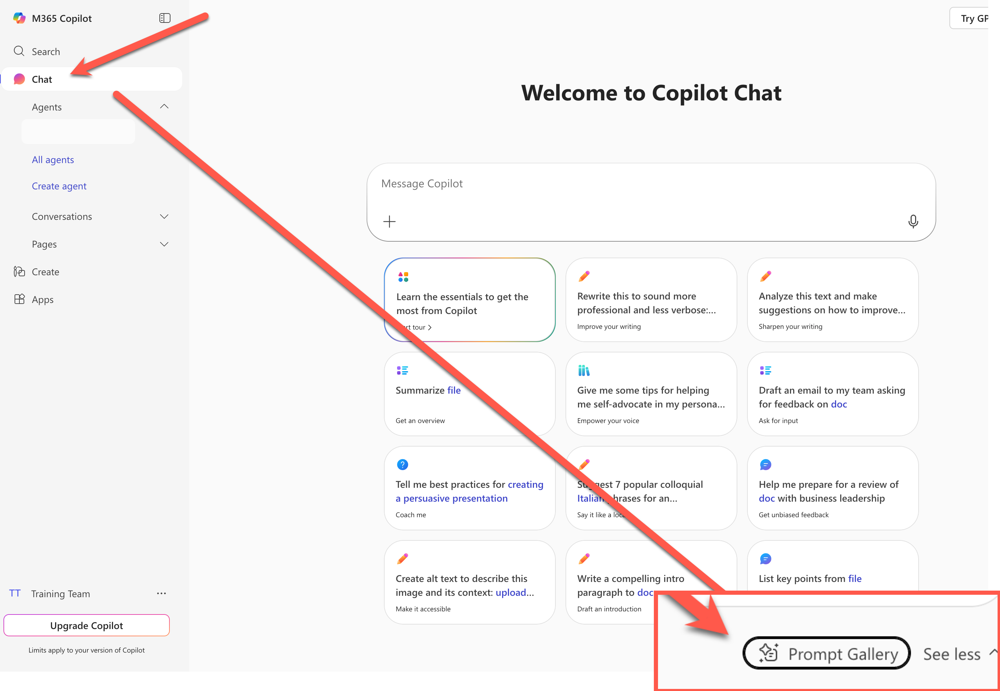
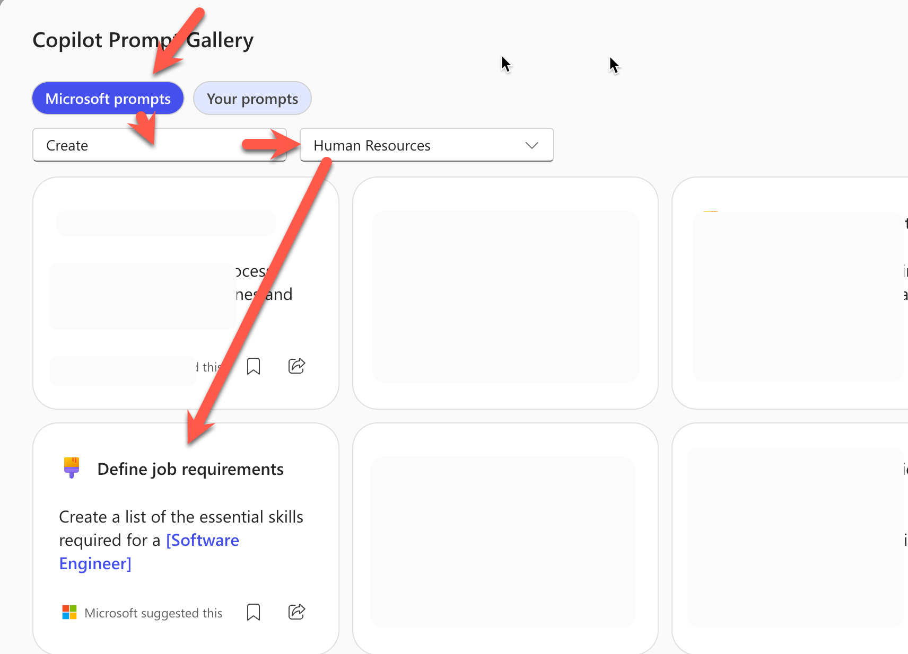
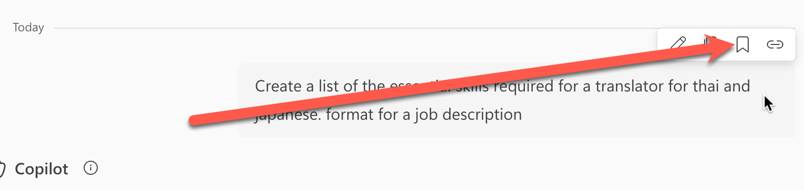
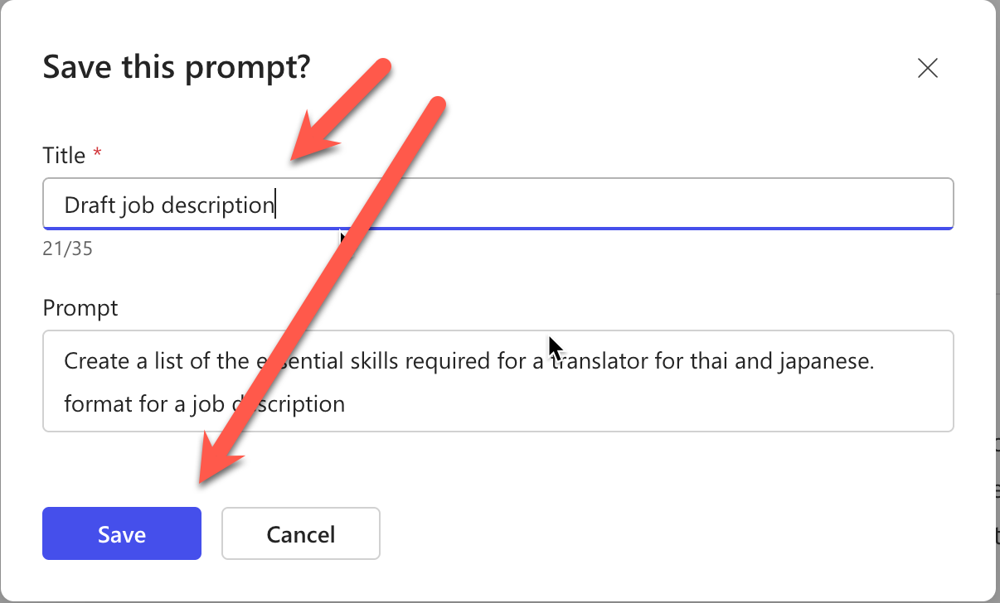
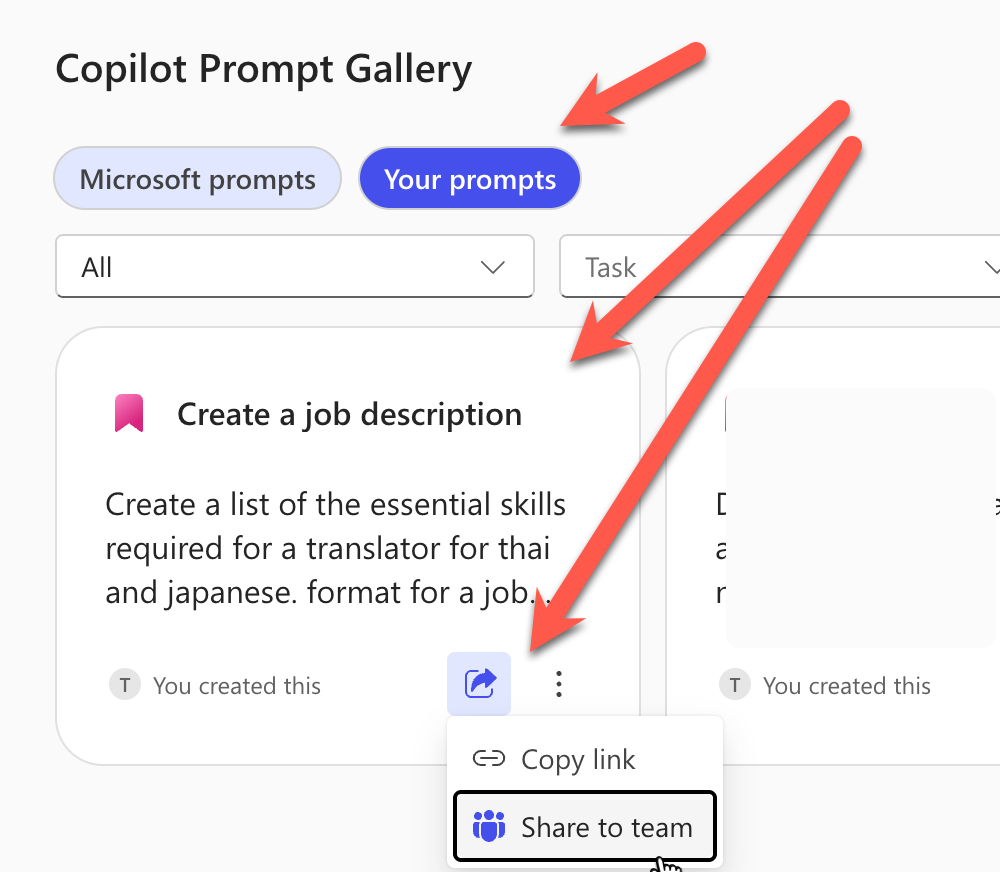

# แบบฝึกหัดที่ 1: Prompt Gallery — สร้างและแชร์ Prompt ให้เพื่อนร่วมงาน

🆓 **ใช้ได้ทั้ง free และ license**

ในแบบฝึกหัดนี้ เราจะได้ลองใช้ **Prompt Gallery** ซึ่งเป็นคลังเก็บ Prompt สำเร็จรูปที่ Microsoft จัดเตรียมไว้ให้ รวมถึงการสร้าง Prompt ของตัวเอง บันทึกไว้ใช้ซ้ำ และแชร์ให้เพื่อนร่วมทีมนำไปใช้งานต่อได้เลย

---

## Feature 1: ค้นหาและใช้งาน Prompt สำเร็จรูป

1. เปิดเบราว์เซอร์ไปที่ [https://m365copilot.com](https://m365copilot.com) แล้ว Login ด้วย account องค์กร

2. ถ้ามีหน้าแชทเดิมค้างอยู่ ให้กดปุ่ม **New chat** ด้านบนขวาก่อน เพื่อเริ่มการสนทนาใหม่
   

3. จากเมนูด้านซ้าย ให้เลือก **Chat** จากนั้นมองหาปุ่ม **Prompt Gallery** ที่อยู่บริเวณใต้กล่องข้อความ แล้วคลิกเพื่อเปิด

   

4. จากหน้าต่าง Prompt Gallery ให้กดเลือก:
   - **Microsoft Prompts**
   - Task: **Create**
   - Department: **Human Resources**
   - เลือก template **"Create a job posting"**

   

5. Prompt จะถูกใส่ลงในกล่องข้อความให้อัตโนมัติ ให้แก้ไขเนื้อหาให้ตรงกับบริบท CPAll เช่น:

   ```
   Create a job posting for a Store Operations Supervisor at a convenience store chain in Thailand. Include responsibilities, qualifications, and benefits.
   ```

6. กด Enter หรือกดปุ่มส่ง แล้วสังเกตผลลัพธ์ที่ได้

> 💡 **เคล็ดลับ:** Template ใน Prompt Gallery เป็นจุดเริ่มต้นที่ดีมาก เราสามารถปรับแก้ข้อความใน Prompt ก่อนส่งได้เสมอ ไม่จำเป็นต้องใช้ตามที่ระบบสร้างให้

---

## Feature 2: สร้างและบันทึก Prompt ของตัวเอง

หลังจากที่เราทดลองใช้ Prompt Gallery แล้ว ลองสร้าง Prompt ของตัวเองและบันทึกเก็บไว้กัน

1. กดปุ่ม **New Chat** เพื่อเริ่มการสนทนาใหม่
   

2. คัดลอก Prompt ด้านล่างนี้ไปใส่ในกล่องข้อความแชท:

   ```
   สรุปยอดขายสินค้าหมวดเครื่องดื่มในร้าน 7-Eleven ประจำสัปดาห์ โดยจัดรูปแบบเป็นตาราง แสดงชื่อสินค้า, จำนวนที่ขายได้, และรายได้รวม
   ```

3. กด Enter แล้วดูผลลัพธ์

4. เลื่อน cursor ไปที่ข้อความ Prompt ที่พิมพ์ไว้ จะมีปุ่มตัวเลือกเล็กๆ ปรากฏขึ้น ให้กดปุ่ม **Save this prompt** (รูปไอคอนบันทึก)

   

5. ตั้งชื่อ Prompt ว่า `สรุปยอดขายเครื่องดื่มรายสัปดาห์` แล้วกดปุ่ม **Save**

   

> 💡 **เคล็ดลับ:** การตั้งชื่อ Prompt ให้ชัดเจนจะทำให้หาเจอง่ายตอนต้องการใช้ซ้ำ ลองตั้งชื่อแบบ "งาน + หัวข้อ" เช่น "สรุปยอดขาย - รายสัปดาห์"

---

## Feature 3: แชร์ Prompt ให้เพื่อนร่วมทีม

Prompt ที่บันทึกไว้สามารถแชร์ให้เพื่อนร่วมงานในองค์กรนำไปใช้ได้ ไม่ต้องเขียนซ้ำทีละคน

1. เปิด **Prompt Gallery** อีกครั้ง แล้วเลือกแท็บ **Your Prompts**

   

2. จะเห็น Prompt ที่เราบันทึกไว้ก่อนหน้า ให้กดปุ่ม **Share** ที่อยู่ข้างๆ Prompt นั้น

3. เลือกตัวเลือกแชร์เป็น **Anyone in my organization** หรือระบุชื่อเพื่อนร่วมทีมที่ต้องการ

4. คัดลอก Link แล้วส่งให้เพื่อนในทีมผ่าน Microsoft Teams หรือ Email

> ⚠️ **หมายเหตุ:** Prompt ที่แชร์จะมองเห็นได้เฉพาะคนในองค์กรเดียวกันเท่านั้น ไม่สามารถแชร์ออกนอกองค์กรได้

---

## สรุป

ในแบบฝึกหัดนี้ คุณได้เรียนรู้:
- การค้นหาและใช้งาน Prompt สำเร็จรูปจาก **Prompt Gallery**
- การสร้างและ **บันทึก Prompt** ที่ปรับแต่งเองสำหรับงาน CPAll
- การ **แชร์ Prompt** ให้เพื่อนร่วมทีมใช้งานร่วมกัน

ขั้นตอนถัดไป → [Copilot Page — รวบรวมข้อมูลและทำงานร่วมกันในทีม](../part1-02-copilot-page/README.md)
