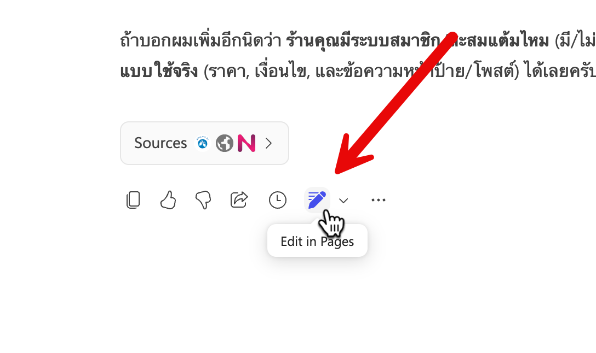
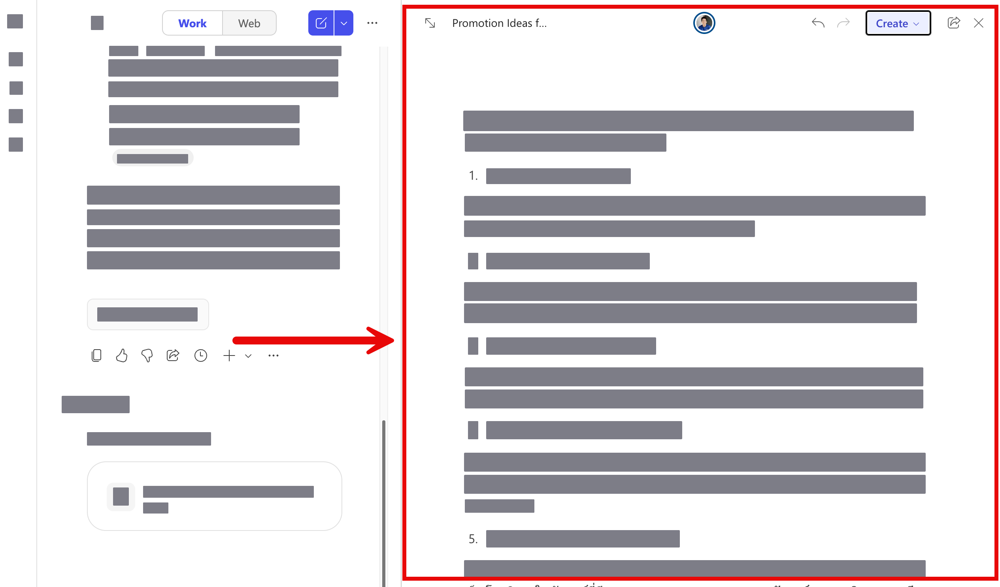
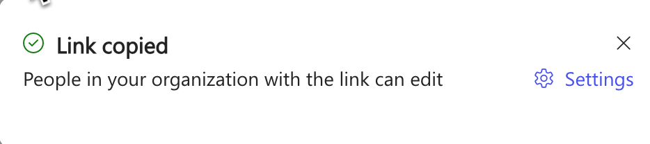
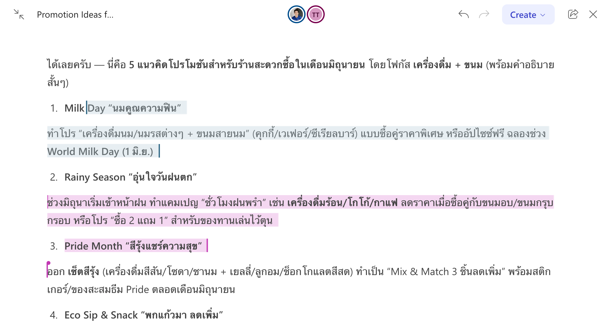

# แบบฝึกหัดที่ 2: Copilot Page — รวบรวมข้อมูลและทำงานร่วมกันในทีม


**Copilot Page** คือพื้นที่ทำงานร่วมกันในแบบ real-time ที่เราสามารถนำผลลัพธ์จาก Copilot Chat มารวบรวมไว้เป็นหน้าเอกสารได้ และยังเชิญเพื่อนร่วมทีมมาแก้ไข เพิ่มเติมข้อมูลได้พร้อมกัน

ในแบบฝึกหัดนี้ เราจะสมมติว่าเป็นทีม Operations ของ CPAll ที่ต้องการรวบรวมข้อมูลแผน Promotion สินค้าในร้าน 7-Eleven สำหรับเดือนหน้า

---

## Feature 1: สร้าง Copilot Page จากผลลัพธ์ Copilot Chat

1. เปิด [https://m365copilot.com](https://m365copilot.com) และเลือก **Chat** จากเมนูด้านซ้าย

2. กดปุ่ม **New Chat** เพื่อเริ่มการสนทนาใหม่

3. คัดลอก Prompt ด้านล่างไปใส่ในกล่องข้อความ แล้วกด Enter:

   ```
   ช่วยสร้างรายการแนวคิด Promotion สำหรับร้านสะดวกซื้อในเดือนมิถุนายน โดยเน้นสินค้าหมวดเครื่องดื่มและขนม มี 5 แนวคิด พร้อมอธิบายสั้นๆ แต่ละข้อ
   ```

4. หลังจาก Copilot ตอบกลับมาแล้ว ให้มองหาปุ่ม **Edit in Pages** หรือไอคอน Page ที่อยู่ใต้ผลลัพธ์ แล้วกดเพื่อสร้าง Copilot Page

   

5. ระบบจะเปิดหน้าต่าง **Copilot Page** ใหม่พร้อมข้อมูลที่ Copilot ตอบมา

   

> 💡 **เคล็ดลับ:** Copilot Page ที่สร้างขึ้นจะถูกบันทึกลงใน **Loop** ของคุณโดยอัตโนมัติ สามารถเข้าถึงได้ภายหลังผ่าน [loop.microsoft.com](https://loop.microsoft.com)

---

## Feature 2: เพิ่มข้อมูลเพิ่มเติมใน Copilot Page

1. จากหน้า Copilot Page ที่เพิ่งสร้าง คุณสามารถพิมพ์เพิ่มเติมหรือแก้ไขเนื้อหาได้เหมือนกับ Document ทั่วไป

2. ลองเพิ่มหัวข้อใหม่โดยพิมพ์ข้อความด้านล่างในหน้า Page:

   ```
   ## งบประมาณโดยประมาณ
   ```

3. จากนั้นใช้ Copilot Chat ช่วยเพิ่มเนื้อหาโดยการกลับไปที่ Copilot Chat ที่คุยค้างไว้ก่อนหน้านี้ แล้วใส่ Prompt:

   ```
   สร้างตารางงบประมาณโดยประมาณสำหรับ Promotion ทั้ง 5 ข้อ โดยมีคอลัมน์ ชื่อ Promotion, งบประมาณ (บาท), ระยะเวลา
   ```

4. กด Enter และ Copilot จะแทรกตารางลงใน Page ให้อัตโนมัติ


---

## Feature 3: แชร์ Copilot Page ให้เพื่อนร่วมทีม

1. จากหน้า Copilot Page ให้กดปุ่ม **Share** ที่มุมขวาบน และเลือก **Page Link**

2. ค่าเริ่มต้นของการแชร์จะเป็น People in your organization with the link can edit ซึ่งเราสามารถปรับเปลี่ยนใน setting ได้
   

3. Link จะถูกคัดลอกไปยังคลิปบอร์ด แล้วส่งให้เพื่อน

4. เมื่อเพื่อนเข้ามาใน Page เดียวกัน ทุกคนสามารถแก้ไขเนื้อหาได้พร้อมกันแบบ real-time

   

> 💡 **เคล็ดลับ:** ถ้าเพื่อนร่วมทีมบางคนไม่มี M365 Copilot License พวกเขายังสามารถเข้ามา **อ่านและแก้ไข** ข้อมูลใน Page ได้ตามปกติ เพียงแต่ไม่สามารถใช้ฟีเจอร์ Copilot ภายใน Page ได้

---

## สรุป

ในแบบฝึกหัดนี้ พวกเราได้:
- การสร้าง **Copilot Page** จากผลลัพธ์ Copilot Chat
- การแก้ไขและเพิ่มเนื้อหาใน Page โดยใช้ Copilot ช่วย
- การ **แชร์ Page** ให้เพื่อนร่วมทีมมาทำงานร่วมกันแบบ real-time

ขั้นตอนถัดไป → [Copilot Notebook — วิเคราะห์ข้อมูลอย่างเป็นระบบ](../part1-03-copilot-notebook/README.md)
