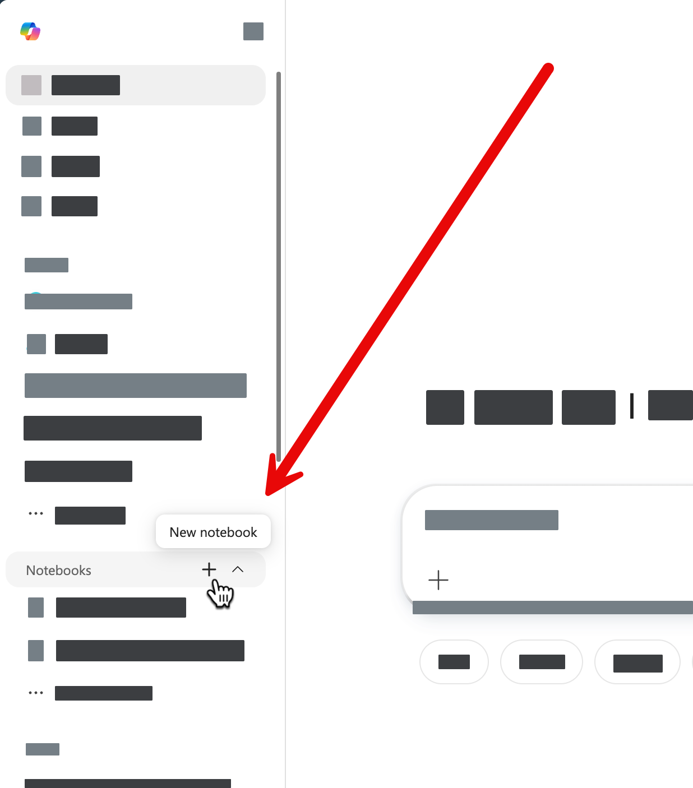
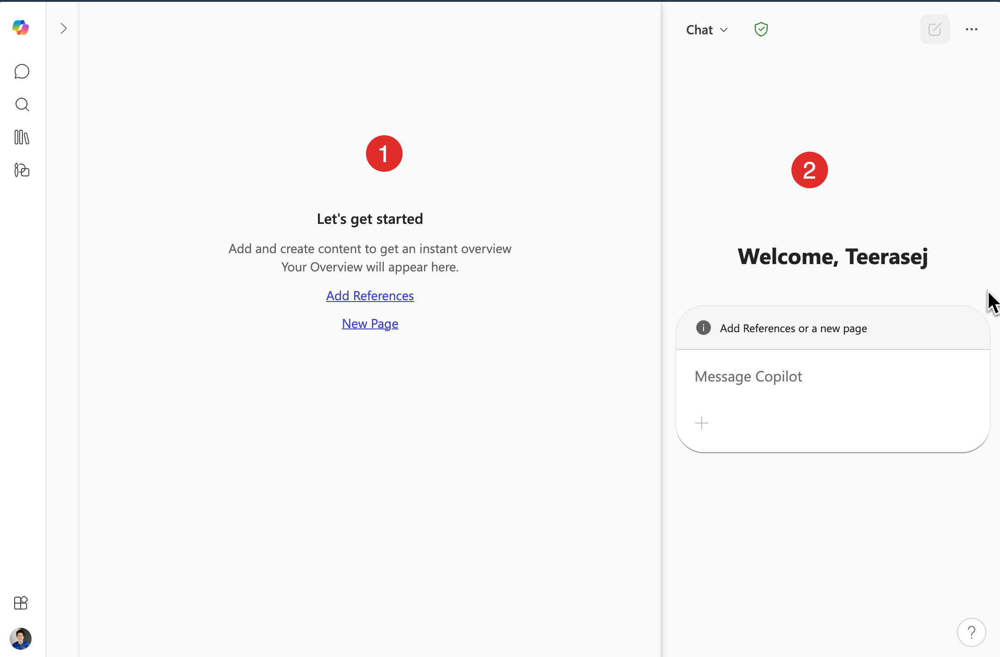

# แบบฝึกหัดที่ 3: Copilot Notebook — วิเคราะห์ข้อมูลอย่างเป็นระบบ

🔑 **ต้องการ M365 Copilot License**

**Copilot Notebook** คือโหมดการทำงานกับ Copilot แบบ "พื้นที่ถาวร" ซึ่งต่างจาก Chat ตรงที่ข้อมูลที่เราป้อนเข้าไปและผลลัพธ์ที่ได้จะถูกเก็บอยู่ใน Notebook เดิมเสมอ ไม่หายไปตามการสนทนา ทำให้เหมาะกับงานที่ต้องทยอยเพิ่มข้อมูลหรือวิเคราะห์หลายรอบ

ในแบบฝึกหัดนี้ เราจะใช้ Copilot Notebook สำหรับงานวิเคราะห์ข้อมูลสินค้าของ CPAll

---

## Feature 1: เปิดและทำความรู้จัก Copilot Notebook

1. เปิด [https://m365copilot.com](https://m365copilot.com) แล้ว Login ด้วย account องค์กร

2. จากเมนูด้านซ้าย ให้มองหาและกดเลือก **Notebook**

   

3. ระบบจะแสดงหน้า Notebook ที่ประกอบด้วย 2 ส่วนหลัก:
   - ด้านซ้าย: **พื้นที่ป้อนข้อมูล (Input Area)** — ใส่เนื้อหาหรือข้อมูลที่ต้องการให้ Copilot วิเคราะห์
   - ด้านขวา: **พื้นที่ผลลัพธ์ (Output Area)** — แสดงผลการวิเคราะห์จาก Copilot

   

> 💡 **เคล็ดลับ:** ความแตกต่างสำคัญของ Notebook กับ Chat คือ Notebook ไม่มีประวัติ "ห้องแชท" — ทุกอย่างอยู่ในหน้าเดียว และเราสามารถแก้ไขข้อมูลฝั่งซ้ายแล้วรันใหม่ได้เรื่อยๆ

---

## Feature 2: วิเคราะห์ข้อมูลสินค้าด้วย Notebook

1. ในพื้นที่ด้านซ้าย ให้คัดลอกข้อมูลสินค้าตัวอย่างด้านล่างนี้วางลงไป:

   ```
   รายการสินค้าขายดีประจำเดือน พฤษภาคม 2026
   
   1. น้ำดื่ม 7-Select 600ml - ขายได้ 4,200 ขวด - รายได้ 42,000 บาท
   2. เรดบูล 150ml - ขายได้ 3,800 กระป๋อง - รายได้ 45,600 บาท
   3. ข้าวกล่องไก่ย่าง - ขายได้ 1,500 กล่อง - รายได้ 67,500 บาท
   4. ซาลาเปาหมูสับ - ขายได้ 3,200 ชิ้น - รายได้ 48,000 บาท
   5. มาม่ารสต้มยำ - ขายได้ 2,900 ซอง - รายได้ 17,400 บาท
   6. Lay's ออริจินัล - ขายได้ 1,800 ถุง - รายได้ 36,000 บาท
   7. กาแฟ 7-Café ลาเต้ - ขายได้ 980 แก้ว - รายได้ 44,100 บาท
   8. โออิชิ ชาเขียว - ขายได้ 2,100 กระป๋อง - รายได้ 42,000 บาท
   ```

2. ในกล่อง Prompt ด้านล่างหรือด้านขวา ให้ใส่คำถามเพื่อให้ Copilot วิเคราะห์:

   ```
   จากข้อมูลนี้ ช่วยวิเคราะห์ว่า:
   1. สินค้าไหนมีรายได้รวมสูงสุด 3 อันดับแรก
   2. หมวดสินค้าไหนทำรายได้ดีที่สุด
   3. ข้อเสนอแนะเพื่อเพิ่มยอดขายสำหรับเดือนถัดไป
   ```

3. กดปุ่ม **Send** และรอดูผลลัพธ์ที่ด้านขวา

   

---

## Feature 3: ต่อยอดการวิเคราะห์ในหน้าเดิม

จุดเด่นของ Notebook คือเราสามารถเพิ่มข้อมูลหรือถามต่อยอดได้โดยไม่ต้องเริ่มใหม่

1. ในพื้นที่ป้อนข้อมูลด้านซ้าย ให้เพิ่มข้อมูลต่อท้ายที่มีอยู่:

   ```
   เป้าหมายยอดขายรวมเดือนมิถุนายน: 380,000 บาท
   งบประมาณ Promotion: 15,000 บาท
   ```

2. ในกล่อง Prompt ให้ถามต่อยอด:

   ```
   จากข้อมูลทั้งหมดและเป้าหมายที่กำหนด ช่วยเสนอแผน Promotion 3 รูปแบบที่น่าจะช่วยให้ถึงเป้าได้ โดยอยู่ในงบประมาณที่กำหนด
   ```

3. กดปุ่ม **Send** อีกครั้ง และสังเกตว่าผลลัพธ์ใหม่จะปรากฏต่อยอดในพื้นที่ด้านขวา

> 💡 **เคล็ดลับ:** Notebook เหมาะมากกับงานที่ต้องวิเคราะห์ข้อมูลหลายรอบ เช่น การเตรียมรายงาน, การวางแผน promotion, หรือการสรุปผลการดำเนินงานรายเดือน เพราะเราสามารถแก้ข้อมูลฝั่งซ้ายและกด Send ใหม่เพื่อได้ผลวิเคราะห์ที่อัพเดตได้ตลอด

---

## สรุป

ในแบบฝึกหัดนี้ คุณได้เรียนรู้:
- ความแตกต่างระหว่าง **Copilot Notebook** กับ **Copilot Chat**
- การป้อนข้อมูลและให้ Copilot **วิเคราะห์ข้อมูลสินค้า**ของ CPAll
- การ **ต่อยอดการวิเคราะห์** โดยเพิ่มข้อมูลและถามใหม่ในหน้าเดิม

---

ยินดีด้วย! คุณผ่าน Part 1 ครบแล้ว 🎉

ขั้นตอนถัดไป → [Part 2: สร้าง Agent ตัวแรก](../part2-01-create-agent/README.md)
