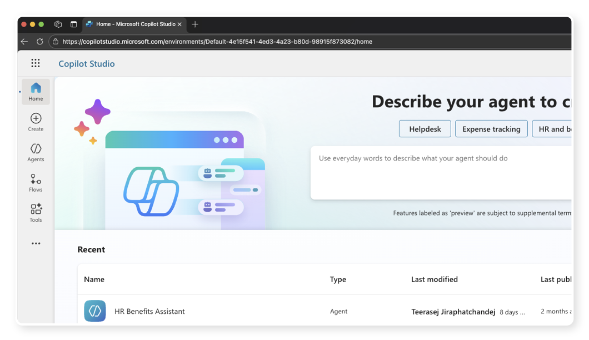
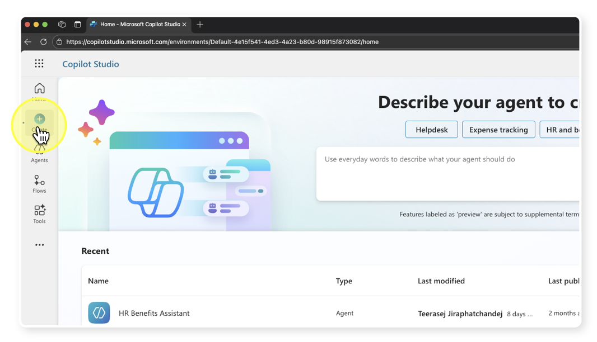
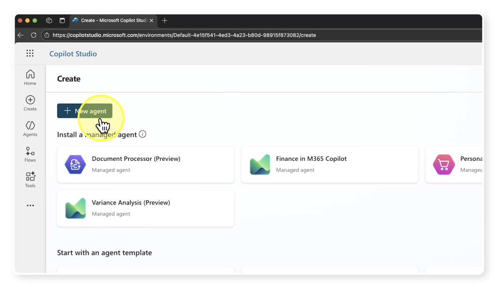
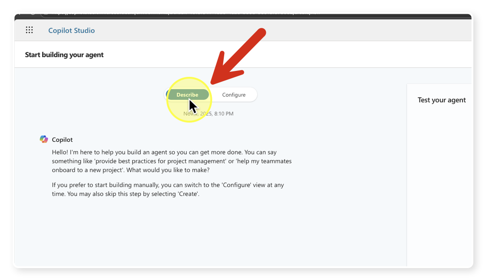
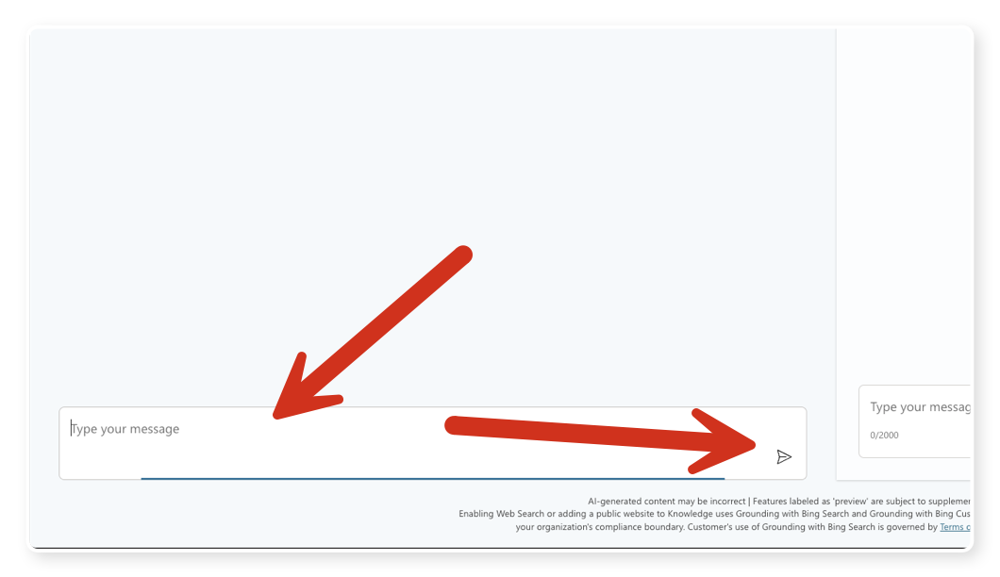
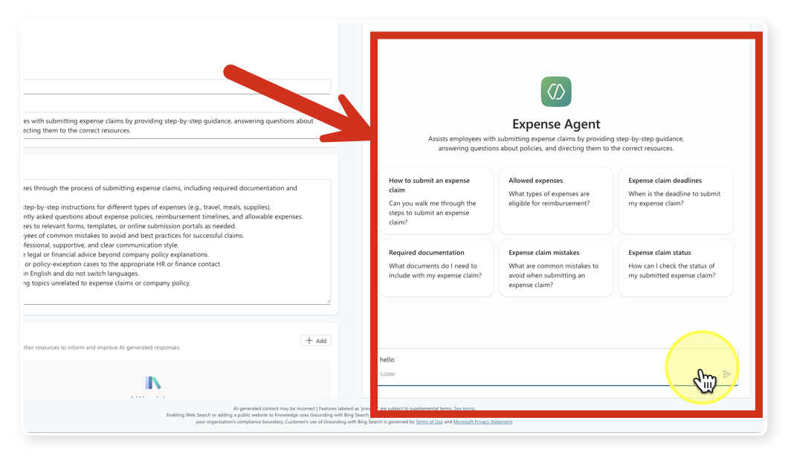
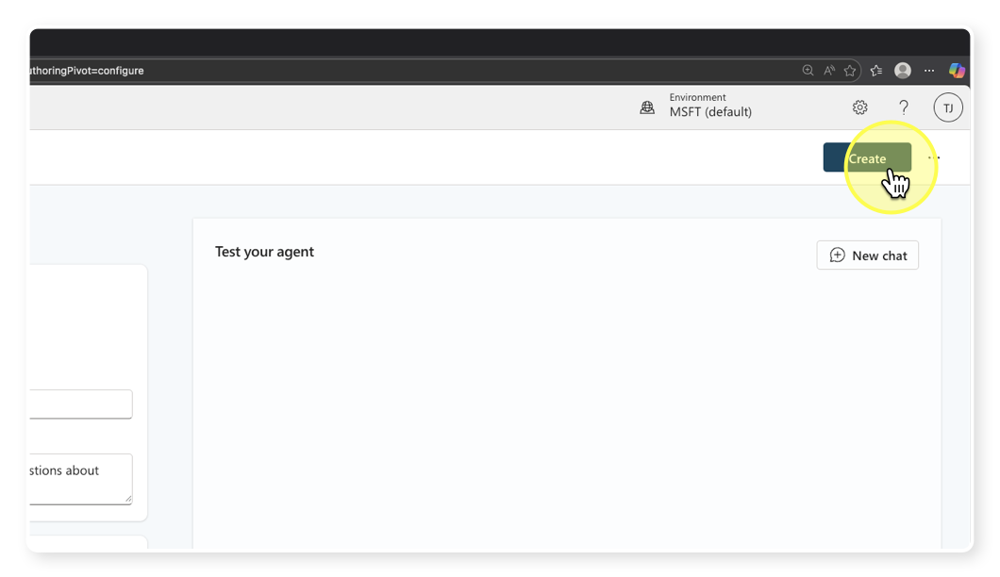

# แบบฝึกหัดที่ 4: สร้าง Agent ตัวแรกด้วย Copilot Studio

🔑 **ต้องการ M365 Copilot License + สิทธิ์เข้าใช้ Copilot Studio**

ในแบบฝึกหัดนี้ เราจะสร้าง **AI Agent** ตัวแรกของเราผ่าน **Copilot Studio** โดย Agent ที่สร้างจะทำหน้าที่ตอบคำถามเกี่ยวกับนโยบาย HR ของ CPAll — เช่น การลา, สวัสดิการ, และการเบิกค่าใช้จ่าย

> ⚠️ **หมายเหตุ:** ถ้ายังไม่มีสิทธิ์เข้า Copilot Studio ในองค์กร ให้ขอจาก IT Admin หรือทดลองดูขั้นตอนไปพร้อมกับเพื่อนที่มีสิทธิ์ก่อนได้เลย

---

## ขั้นตอนที่ 1: เข้าสู่ Copilot Studio

1. เปิดเบราว์เซอร์ไปที่ [https://copilotstudio.microsoft.com](https://copilotstudio.microsoft.com)

2. Login ด้วย Microsoft account ขององค์กร

3. ตรวจสอบว่าอยู่ใน **Environment** ที่ถูกต้อง (สังเกตที่มุมขวาบน ควรแสดงชื่อองค์กรของคุณ)

   

---

## ขั้นตอนที่ 2: สร้าง Agent ใหม่

1. จากเมนูด้านซ้าย ให้คลิกที่ **Create**

   

2. คลิกปุ่ม **New agent** ที่มุมขวาบนของหน้า

   

3. ระบบจะเข้าสู่โหมด **Describe** ซึ่งเป็นการสร้าง Agent ด้วยการพิมพ์อธิบายหน้าที่ให้เป็นภาษาธรรมดา

   

---

## ขั้นตอนที่ 3: กำหนดหน้าที่ให้ Agent ด้วยภาษาธรรมดา

1. ในช่องแชทของโหมด Describe ให้คัดลอกข้อความด้านล่างนี้ไปวาง แล้วกด Enter:

   ```
   You are a helpful HR assistant for CPAll employees. You answer questions about company HR policies including leave requests, expense claims, employee benefits, and working hour regulations. Only answer questions related to HR topics.
   ```

   

2. Copilot Studio จะตอบรับและสรุปขอบเขตการทำงานของ Agent ให้ จากนั้นจะถามชื่อ Agent

3. ตั้งชื่อ Agent ว่า:

   ```
   CPAll HR Assistant
   ```

4. กด Enter และรอให้ระบบยืนยัน

---

## ขั้นตอนที่ 4: เพิ่มคำสั่งเสริม (ถ้าต้องการ)

1. คุณสามารถเพิ่มรายละเอียดขอบเขตการทำงานให้ชัดขึ้นได้ เช่น:

   ```
   Always answer in Thai language. Keep responses concise and professional. If you don't know the answer, suggest contacting the HR department directly.
   ```

2. กด Enter เพื่อบันทึกคำสั่งเสริม

> 💡 **เคล็ดลับ:** การเขียนคำสั่ง (Instruction) ให้ Agent ชัดเจนจะช่วยให้ Agent ตอบคำถามได้ตรงประเด็นมากขึ้น และลดโอกาสที่ Agent จะตอบเรื่องที่ไม่เกี่ยวข้อง

---

## ขั้นตอนที่ 5: ทดสอบ Agent

1. สังเกตด้านขวาของหน้าจอ จะมีหน้าต่างพรีวิว Agent พร้อมให้ทดสอบทันที

   

2. พิมพ์คำถามทดสอบต่อไปนี้ แล้วดูว่า Agent ตอบอย่างไร:

   ```
   ลาป่วยได้กี่วันต่อปี?
   ```

3. ทดสอบอีกครั้งกับคำถามที่อยู่นอกขอบเขต เพื่อดูว่า Agent ปฏิเสธอย่างไร:

   ```
   ช่วยแนะนำร้านอาหารใกล้สำนักงานหน่อย
   ```

4. Agent ควรปฏิเสธคำถามข้อที่ 2 เนื่องจากอยู่นอกขอบเขตที่กำหนดไว้

---

## ขั้นตอนที่ 6: สร้าง Agent และไปยังหน้าตั้งค่า

1. เมื่อทดสอบแล้วพอใจ ให้กดปุ่ม **Create** ที่มุมขวาบน

   

2. รอสักครู่ ระบบจะประมวลผลและสร้าง Agent ของคุณ

3. หลังจากสร้างเสร็จ ระบบจะนำคุณไปยังหน้าการตั้งค่า Agent ซึ่งเราจะมาปรับแต่งเพิ่มเติมในแบบฝึกหัดถัดไป

> **สิ้นสุดขั้นตอนนี้ — คุณมี Agent ใหม่ชื่อ "CPAll HR Assistant" พร้อมใช้งานแล้ว!**

---

## สรุป

ในแบบฝึกหัดนี้ คุณได้เรียนรู้:
- การเข้าใช้งาน **Copilot Studio** และสร้าง Agent ใหม่
- การกำหนดหน้าที่ให้ Agent ด้วย **ภาษาธรรมดา** (Describe Mode)
- การ **ทดสอบ Agent** เบื้องต้นผ่านหน้าพรีวิว

ขั้นตอนถัดไป → [เพิ่ม Knowledge ให้ Agent](../part2-02-adding-knowledge/README.md)
