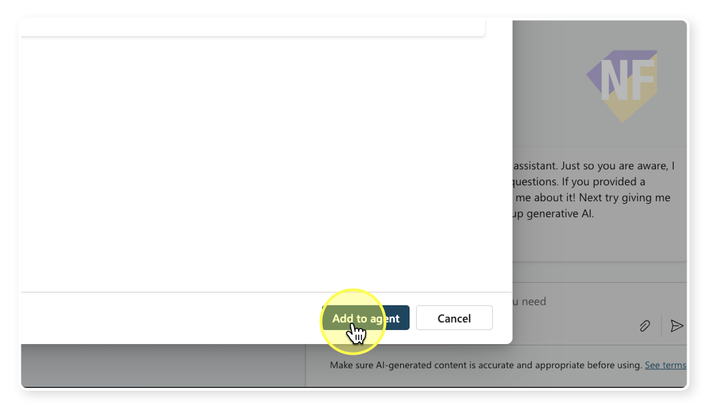
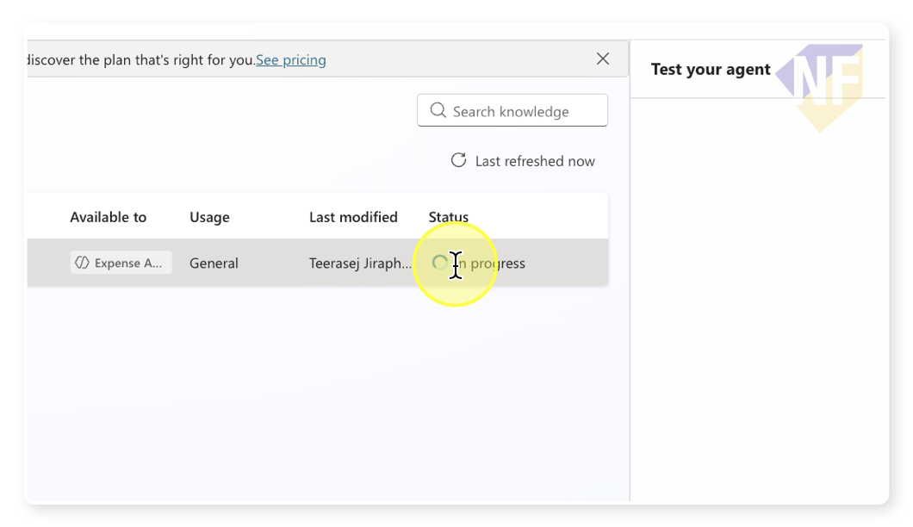

# แบบฝึกหัดที่ 5: เพิ่ม Knowledge ให้ Agent

🔑 **ต้องการ M365 Copilot License + สิทธิ์เข้าใช้ Copilot Studio**

ตอนนี้ Agent ของเราตอบคำถามได้จาก "ความรู้ทั่วไป" ของ AI เท่านั้น แต่ถ้าเราอยากให้ Agent ตอบคำถามจาก **ข้อมูลจริงขององค์กร** — เช่น catalog สินค้า, นโยบายภายใน, หรือเว็บไซต์บริษัท — เราต้องเพิ่ม **Knowledge** เข้าไปให้ Agent ก่อน

ในแบบฝึกหัดนี้ เราจะเพิ่ม Knowledge ให้ Agent 2 รูปแบบ คือ **การอัพโหลดไฟล์** และ **การเพิ่ม URL เว็บไซต์**

---

## เตรียมไฟล์ที่ใช้ในแบบฝึกหัด

ดาวน์โหลดหรือเปิดไฟล์ต่อไปนี้เพื่อเตรียมใช้งาน:
- 📄 [cpall-product-catalog.csv](../../files/cpall-product-catalog.csv) — ข้อมูล catalog สินค้า 7-Eleven

> 💡 **เคล็ดลับ:** คุณสามารถเปิดไฟล์ `.csv` ด้วย Excel ได้เลยโดยไม่ต้องแปลงรูปแบบไฟล์

---

## Feature 1: เพิ่ม Knowledge ด้วยการอัพโหลดไฟล์

1. เปิด [Copilot Studio](https://copilotstudio.microsoft.com) และเลือก Agent **CPAll HR Assistant** ที่สร้างไว้ในแบบฝึกหัดก่อนหน้า

2. จากแถบเมนูด้านบน ให้กดเลือกแท็บ **Knowledge**

   

3. กดปุ่ม **+ Add knowledge**

   

4. เลือกตัวเลือก **Upload files** (อัพโหลดไฟล์)

5. กดปุ่ม **Select to Browse** แล้วเลือกไฟล์ `cpall-product-catalog.csv` จากเครื่องของคุณ

   

6. ใส่รายละเอียดของไฟล์เพื่อให้ Agent เข้าใจว่าข้อมูลนี้คืออะไร:
   - Name: `CPAll Product Catalog`
   - Description: `รายการสินค้าในร้าน 7-Eleven ของ CPAll พร้อมราคาและหมวดหมู่`

   

7. กดปุ่ม **Add to Agent** เพื่อยืนยันการอัพโหลด

   

8. รอสักครู่จนกว่าสถานะจะเปลี่ยนเป็น **Ready** (อาจใช้เวลา 1-3 นาที)

   

> ⚠️ **หมายเหตุ:** ระหว่างที่ระบบประมวลผลไฟล์ สถานะจะแสดงว่า "Processing" ไม่ต้องตกใจ รอให้เปลี่ยนเป็น "Ready" ก่อนค่อยทดสอบ

---

## Feature 2: เพิ่ม Knowledge จาก URL เว็บไซต์

นอกจากไฟล์ เราสามารถให้ Agent เรียนรู้จาก **เว็บไซต์สาธารณะ** ได้ด้วย

1. จากแท็บ **Knowledge** กดปุ่ม **+ Add knowledge** อีกครั้ง

2. คราวนี้ให้เลือกตัวเลือก **Website URL** (หรือ Public websites)

3. ใส่ URL ของเว็บไซต์ CPAll:

   ```
   https://www.cpall.co.th/
   ```

4. ใส่รายละเอียด:
   - Name: `CPAll Official Website`
   - Description: `ข้อมูลองค์กร CPAll และกิจกรรมล่าสุดจากเว็บไซต์ทางการ`

5. กดปุ่ม **Add** และรอให้ระบบประมวลผล

> 💡 **เคล็ดลับ:** Agent สามารถเรียนรู้จากหลาย URL พร้อมกันได้ ลองเพิ่ม URL หน้า CSR หรือหน้า Investor Relations ของ CPAll ด้วยก็ได้ถ้าต้องการ

---

## Feature 3: ทดสอบ Agent หลังเพิ่ม Knowledge

1. ไปที่หน้าต่างทดสอบ Agent ด้านขวา หรือกดแท็บ **Test**

2. ทดสอบด้วยคำถามที่เกี่ยวกับไฟล์ที่อัพโหลด:

   ```
   มีสินค้าหมวดเครื่องดื่มอะไรบ้าง และราคาเท่าไหร่?
   ```

3. ทดสอบอีกครั้งด้วยคำถามเจาะจงมากขึ้น:

   ```
   สินค้าไหนมีราคาต่ำกว่า 20 บาทบ้าง?
   ```

4. สังเกตว่า Agent จะแสดง **แหล่งอ้างอิง (Citation)** จากไฟล์ที่อัพโหลดด้วยหรือเปล่า

5. ทดสอบกับข้อมูลจากเว็บไซต์:

   ```
   CPAll ก่อตั้งเมื่อไหร่ และมีร้าน 7-Eleven กี่สาขา?
   ```

> ⚠️ **หมายเหตุ:** ถ้า Agent ยังตอบไม่ได้ ให้ตรวจสอบว่าสถานะของ Knowledge ทั้งหมดเป็น **Ready** แล้วหรือยัง

---

## สรุป

ในแบบฝึกหัดนี้ คุณได้เรียนรู้:
- การเพิ่ม **Knowledge จากไฟล์** (CSV, PDF, Excel) ให้ Agent รู้จักข้อมูลองค์กร
- การเพิ่ม **Knowledge จาก URL เว็บไซต์** สาธารณะ
- การทดสอบ Agent และตรวจสอบ **Citation** จากแหล่งข้อมูล

ขั้นตอนถัดไป → [เพิ่ม Tools — ส่งสรุปทาง Outlook](../part2-03-adding-tools/README.md)
