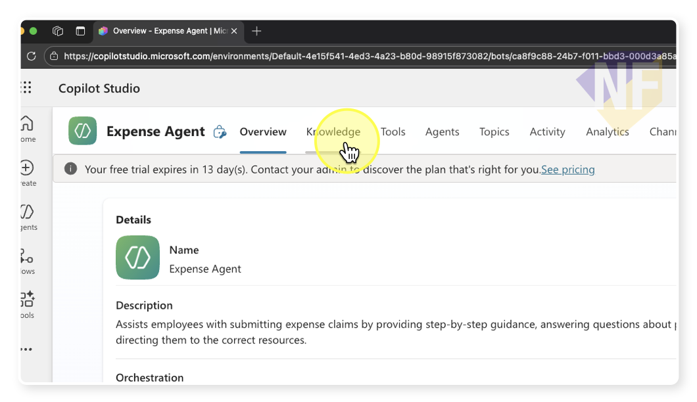
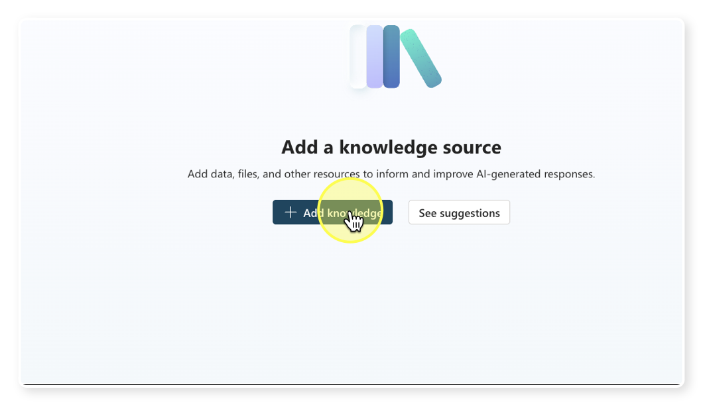
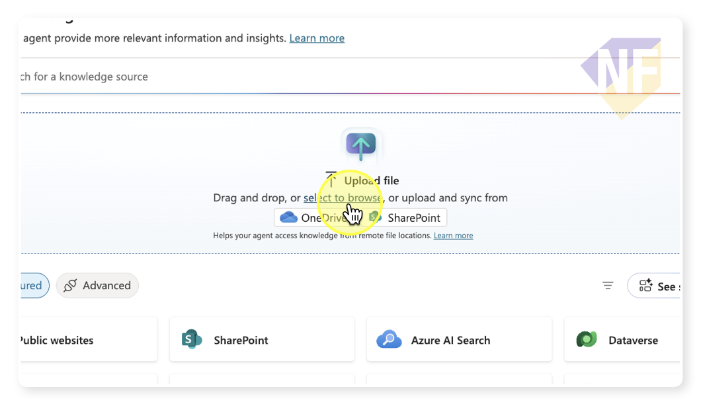
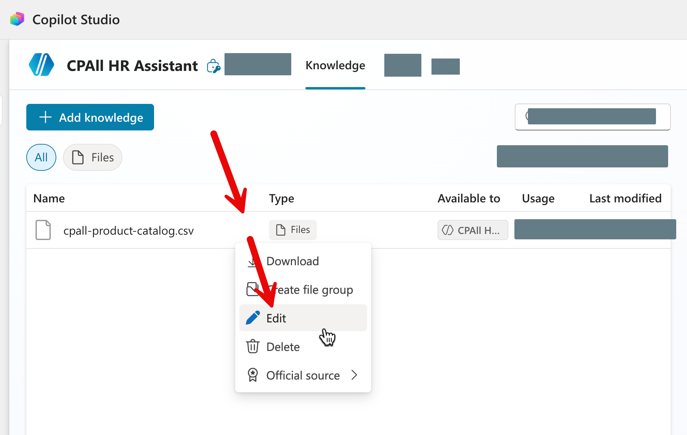

# แบบฝึกหัดที่ 5: เพิ่ม Knowledge ให้ Agent

🔑 **ต้องการ M365 Copilot License + สิทธิ์เข้าใช้ Copilot Studio**

ตอนนี้ Agent ของเราตอบคำถามได้จาก "ความรู้ทั่วไป" ของ AI เท่านั้น แต่ถ้าเราอยากให้ Agent ตอบคำถามจาก **ข้อมูลจริงขององค์กร** — เช่น catalog สินค้า, นโยบายภายใน, หรือเว็บไซต์บริษัท — เราต้องเพิ่ม **Knowledge** เข้าไปให้ Agent ก่อน

ในแบบฝึกหัดนี้ เราจะเพิ่ม Knowledge ให้ Agent 2 รูปแบบ คือ **การอัพโหลดไฟล์** และ **การเพิ่ม URL เว็บไซต์**

---

## เตรียมไฟล์ที่ใช้ในแบบฝึกหัด

ดาวน์โหลดหรือเปิดไฟล์ต่อไปนี้เพื่อเตรียมใช้งาน:
- 📄 [cpall-product-catalog.csv](../../files/cpall-product-catalog.csv) — ข้อมูล catalog สินค้า 7-Eleven

> 💡 **เคล็ดลับ:** คุณสามารถเปิดไฟล์ `.csv` ด้วย Excel ได้เลยโดยไม่ต้องแปลงรูปแบบไฟล์

---

## Feature 1: เพิ่ม Knowledge ด้วยการอัพโหลดไฟล์

1. เปิด [Copilot Studio](https://copilotstudio.microsoft.com) และเลือก Agent **CPAll HR Assistant** ที่สร้างไว้ในแบบฝึกหัดก่อนหน้า

2. จากแถบเมนูด้านบน ให้กดเลือกแท็บ **Knowledge**

   

3. กดปุ่ม **+ Add knowledge**

   

4. เลือกตัวเลือก **Upload files** (อัพโหลดไฟล์)

5. กดปุ่ม **Select to Browse** แล้วเลือกไฟล์ `Expense_Policy.pdf` จากเครื่องของคุณ

   

6. กดปุ่ม **Add to Agent** และรอให้ระบบอัพโหลดและประมวลผลไฟล์ (อาจใช้เวลา 1-3 นาที ขึ้นอยู่กับขนาดไฟล์)
7. เสร็จแล้วรายการไฟล์จะปรากฏในหน้า Knowledge พร้อมสถานะว่า "Ready" แปลว่า Agent สามารถเข้าถึงข้อมูลในไฟล์นี้ได้แล้ว


8. กดปุ่ม **More options** ที่อยู่ด้านขวาของชื่อไฟล์ เราสามารถเพิ่มรายละเอียดให้ไฟล์นี้ได้มากขึ้น และจะเป็นประโยชน์มากเวลาที่ Agent ต้องเลือกอ้างอิงข้อมูลจากหลายไฟล์พร้อมกัน

   

> ⚠️ **หมายเหตุ:** ระหว่างที่ระบบประมวลผลไฟล์ สถานะจะแสดงว่า "Processing" ไม่ต้องตกใจ รอให้เปลี่ยนเป็น "Ready" ก่อนค่อยทดสอบ

---

## Feature 2: เพิ่ม Knowledge จาก URL เว็บไซต์

นอกจากไฟล์ เราสามารถให้ Agent เรียนรู้จาก **เว็บไซต์สาธารณะ** ได้ด้วย

1. จากแท็บ **Knowledge** กดปุ่ม **+ Add knowledge** อีกครั้ง

2. คราวนี้ให้เลือกตัวเลือก **Public websites** 

3. ใส่ URL ของเว็บไซต์ข่าวสารของ CPAll:

   ```
   https://www.cpall.co.th/category/news/
   ```

4. ใส่รายละเอียด:
   - Name: `CPAll News and Annoucement`
   - Description: `ข้อมูลองค์กร CPAll และกิจกรรมล่าสุดจากเว็บไซต์ทางการ`

5. กดปุ่ม **Add** และรอให้ระบบประมวลผล

> 💡 **เคล็ดลับ:** Agent สามารถเรียนรู้จากหลาย URL พร้อมกันได้ ลองเพิ่ม URL หน้า CSR หรือหน้า Investor Relations ของ CPAll ด้วยก็ได้ถ้าต้องการ

---

## Feature 3: ทดสอบการทำงานของ Agent หลังเพิ่ม Knowledge

1. **เริ่มทดสอบ Agent**
   - ไปที่แท็บ **Test** หรือพื้นที่แชทด้านขวาของหน้าจอ
   - เริ่มถามคำถามเกี่ยวกับข้อมูลจากไฟล์ที่อัปโหลด เช่น

   ```
   What is the maximum amount for meal reimbursement?
   ```

   ```
   วงเงินสูงสุดสำหรับค่าอาหารเบิกได้เท่าไหร่?
   ```

   - กดส่งข้อความ และรอให้ Agent ตอบกลับ

2. **ทดสอบคำถามเพิ่มเติม**
   - ลองถามคำถามเจาะจงเพิ่มเติมจากไฟล์เดียวกัน เช่น

   ```
   How long does it take to process an expense claim?
   ```

   - จากนั้นทดสอบคำถามจาก Knowledge แบบเว็บไซต์ เช่น

   ```
   CPAll มีกิจกรรมล่าสุดอะไรบ้าง?
   ```

   - สังเกตว่า Agent สามารถตอบจากแหล่งข้อมูลที่เพิ่มไว้ได้ถูกต้องหรือไม่

3. **ตรวจสอบแหล่งอ้างอิง (Citation)**
   - สังเกตว่า Agent แสดงแหล่งที่มาของข้อมูลจากไฟล์หรือเว็บไซต์ที่เพิ่มไว้หรือไม่
   - ลองคลิก Citation เพื่อดูว่าระบบอ้างอิงไปยังเนื้อหาต้นทางที่เกี่ยวข้องได้ถูกต้องหรือไม่

> ⚠️ **หมายเหตุ:** ถ้า Agent ยังตอบไม่ได้ ให้ตรวจสอบว่าสถานะของ Knowledge ทั้งหมดเป็น **Ready** แล้วหรือยัง

---

## สรุป

ในแบบฝึกหัดนี้ คุณได้เรียนรู้:
- การเพิ่ม **Knowledge จากไฟล์** (CSV, PDF, Excel) ให้ Agent รู้จักข้อมูลองค์กร
- การเพิ่ม **Knowledge จาก URL เว็บไซต์** สาธารณะ
- การทดสอบ Agent และตรวจสอบ **Citation** จากแหล่งข้อมูล

ขั้นตอนถัดไป → [เพิ่ม Tools — ส่งสรุปทาง Outlook](../part2-03-adding-tools/README.md)
