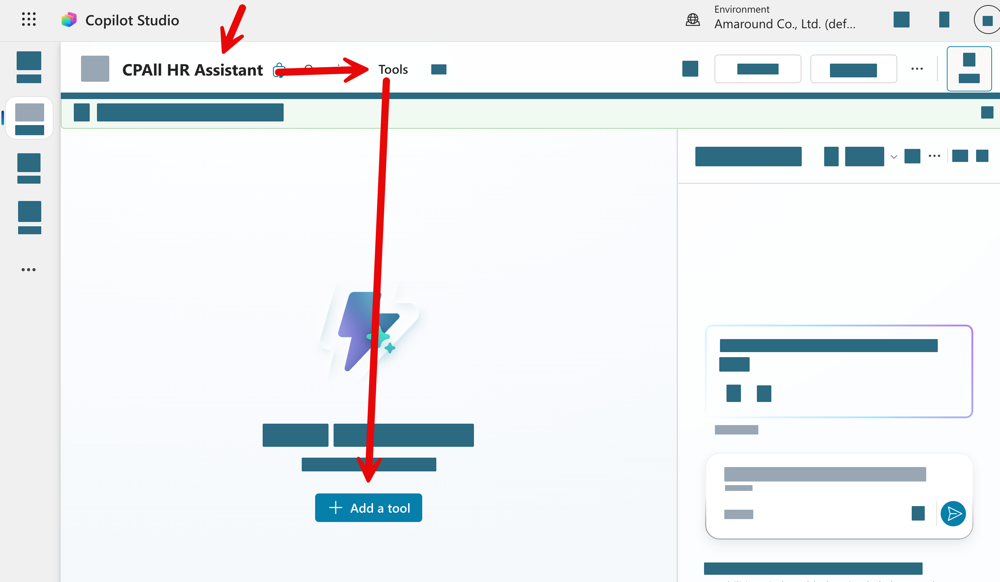
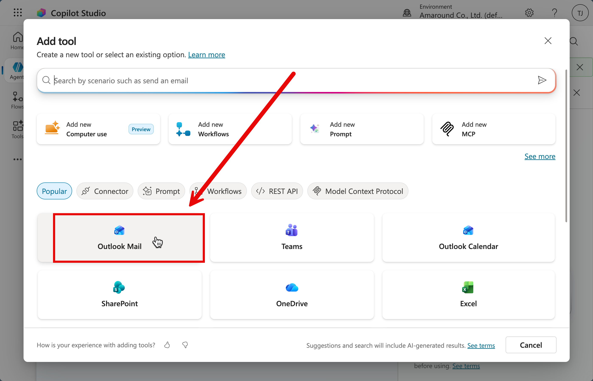
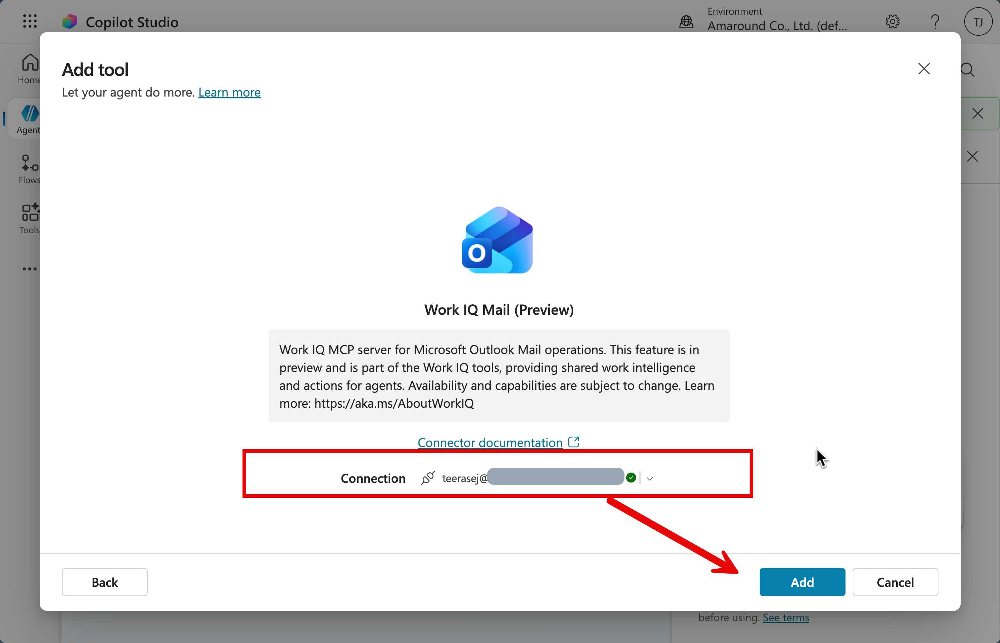

# แบบฝึกหัดที่ 6: เพิ่ม Tools — ให้ Agent ส่งสรุปทาง Outlook

🔑 **ต้องการ M365 Copilot License + สิทธิ์เข้าใช้ Copilot Studio**

ถึงตอนนี้ Agent ของเราตอบคำถามได้จากข้อมูลที่เราเพิ่มเข้าไปแล้ว ขั้นตอนต่อไปเราจะให้ Agent สามารถ **ลงมือทำงาน** ได้ด้วย โดยการเพิ่ม **Tool** เชื่อมต่อกับ Outlook เพื่อให้ Agent ส่งอีเมลสรุปผลให้ผู้รับที่กำหนดได้เมื่อถูกสั่ง

---

## ทำความเข้าใจ Tool ใน Copilot Studio

**Tool** ใน Copilot Studio คือความสามารถพิเศษที่เพิ่มให้ Agent ทำงานนอกเหนือจากการตอบคำถาม เช่น:
- ส่งอีเมลผ่าน **Outlook**
- สร้าง Task ใน **Microsoft Planner**
- อ่าน/เขียนข้อมูลใน **SharePoint**

ในแบบฝึกหัดนี้เราจะเพิ่ม Tool สำหรับ Outlook

---

## ขั้นตอนที่ 1: เปิดหน้า Agent และไปที่แท็บ Actions

1. เปิด [Copilot Studio](https://copilotstudio.microsoft.com) และเลือก Agent **CPAll HR Assistant**

2. จากแถบเมนูด้านบน ให้กดเลือกแท็บ **Actions** (หรือ Tools ในบางเวอร์ชัน)

   

3. กดปุ่ม **+ Add action**

   

---

## ขั้นตอนที่ 2: เลือก Outlook Connector

1. ในหน้าต่างเลือก Action ให้ค้นหาคำว่า `outlook` หรือ `send email`

2. เลือก **"Send an email (V2)"** จาก Microsoft Outlook connector

   

3. ระบบอาจขอให้ยืนยันการเชื่อมต่อกับ Outlook ให้กด **Connect** และ Login ด้วย account องค์กร

4. หลังจาก Connect แล้ว กดปุ่ม **Add to agent** เพื่อเพิ่ม Tool เข้า Agent

   

> ⚠️ **หมายเหตุ:** การเชื่อมต่อ Outlook จำเป็นต้องมีสิทธิ์ใน Microsoft 365 ที่รองรับ Power Automate หรือ Connector ถ้าไม่สามารถเชื่อมต่อได้ ให้ติดต่อ IT Admin ขององค์กร

---

## ขั้นตอนที่ 3: กำหนดพฤติกรรมการใช้ Tool

1. หลังจากเพิ่ม Outlook Tool แล้ว ให้กลับไปที่แท็บ **Overview** หรือ **Instructions** แล้วเพิ่มคำสั่งให้ Agent รู้ว่าควรใช้ Tool นี้เมื่อใด:

   ```
   When a user asks you to send a summary or report via email, use the Outlook tool to send the email. Always confirm the recipient's email address before sending.
   ```

2. กดปุ่ม **Save** เพื่อบันทึกการเปลี่ยนแปลง

---

## ขั้นตอนที่ 4: ทดสอบการส่งอีเมลผ่าน Agent

1. ไปที่หน้าต่างทดสอบด้านขวา

2. ถามข้อมูลก่อน แล้วสั่งให้ Agent ส่งสรุปทางอีเมล:

   ```
   ช่วยสรุปรายการสินค้าหมวดเครื่องดื่มทั้งหมด และส่งสรุปนั้นทางอีเมลไปที่ [ใส่อีเมลของคุณ]
   ```

3. Agent จะถามยืนยันอีเมลปลายทางก่อน ให้ตอบยืนยัน

4. หลังจากนั้น Agent จะส่งอีเมลสรุปไปยังปลายทางที่กำหนด

5. เปิด **Outlook** หรือ email ของคุณเพื่อตรวจสอบว่าได้รับอีเมลจาก Agent หรือเปล่า

   

> 💡 **เคล็ดลับ:** ในการใช้งานจริง คุณสามารถสั่งให้ Agent ส่งสรุปรายงานยอดขาย, สรุปข้อมูลสินค้า, หรือแจ้งเตือนทีมงานได้โดยอัตโนมัติ เพียงแค่บอก Agent ว่าต้องการส่งอีเมลถึงใคร และเรื่องอะไร

---

## สรุป

ในแบบฝึกหัดนี้ คุณได้เรียนรู้:
- ความหมายของ **Tool** ใน Copilot Studio และประโยชน์ที่ได้
- การเพิ่ม **Outlook Tool** ให้ Agent สามารถส่งอีเมลได้
- การทดสอบสั่ง Agent ให้ **ส่งสรุปทางอีเมล** ไปยังผู้รับที่ต้องการ

ขั้นตอนถัดไป → [Publishing — เผยแพร่ Agent ให้ทีมใช้งาน](../part2-04-publishing/README.md)
