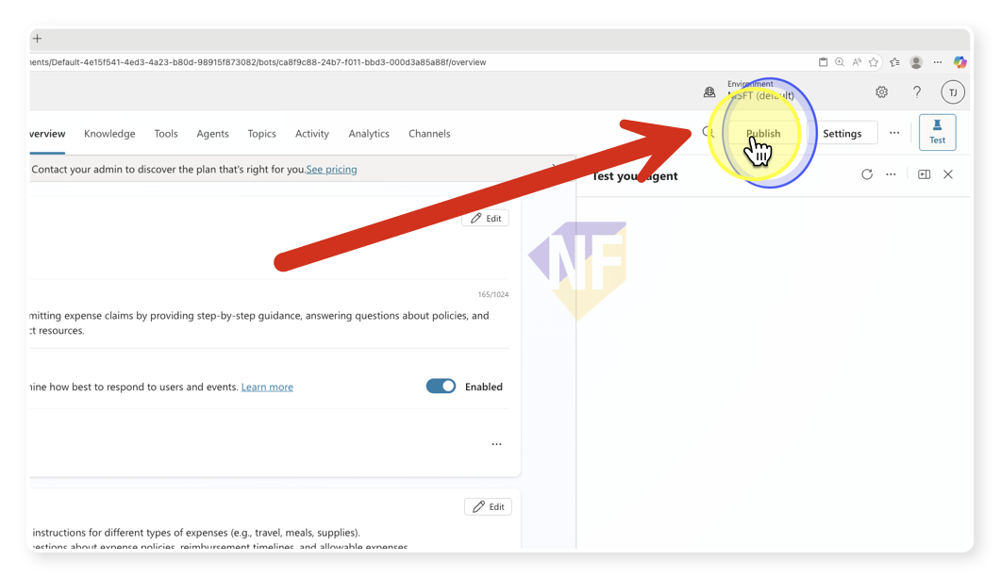
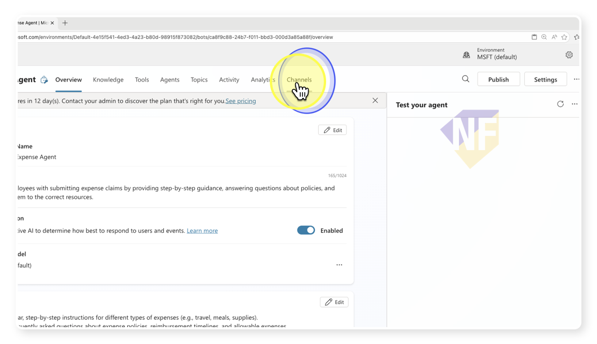
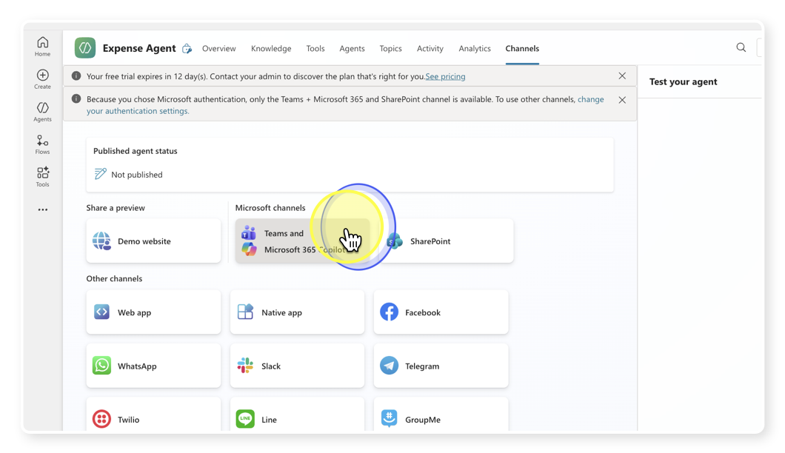
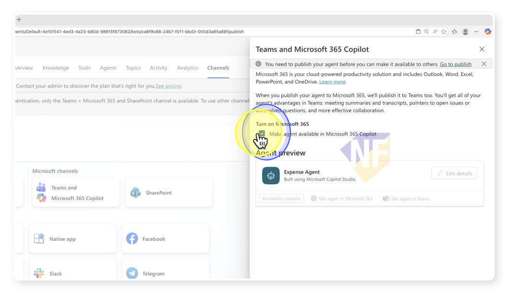
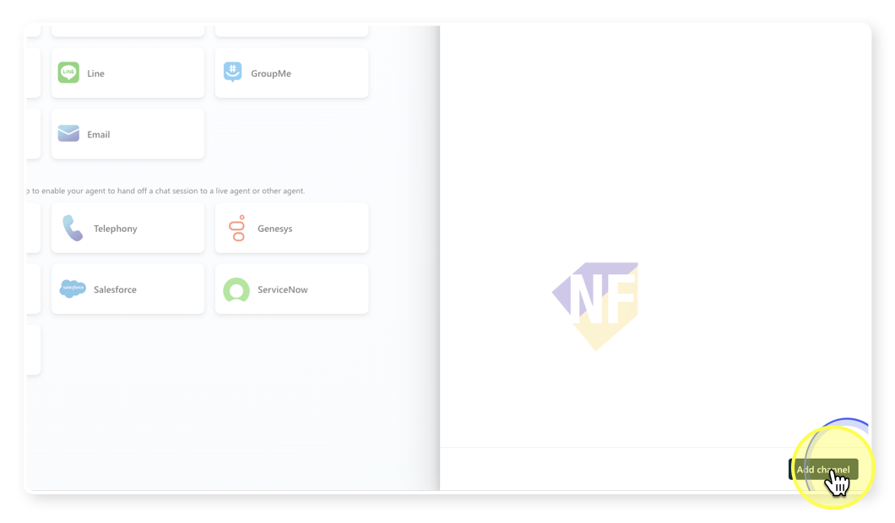

# แบบฝึกหัดที่ 7: Publishing — เผยแพร่ Agent ให้ทีมใช้งาน

🔑 **ต้องการ M365 Copilot License + สิทธิ์เข้าใช้ Copilot Studio**

Agent ที่สร้างไว้นั้น ตอนนี้ยังใช้ได้แค่ผู้สร้างคนเดียว ในแบบฝึกหัดสุดท้ายนี้ เราจะเรียนรู้วิธี **Publish Agent** เพื่อเผยแพร่ให้เพื่อนร่วมทีมหรือพนักงาน CPAll ทั้งองค์กรสามารถเรียกใช้ผ่าน **Microsoft Teams** และ **Microsoft 365 Copilot** ได้เลย

---

## ขั้นตอนที่ 1: Publish Agent

1. เปิด [Copilot Studio](https://copilotstudio.microsoft.com) และเลือก Agent **CPAll HR Assistant**

2. มองหาปุ่ม **Publish** ที่มุมขวาบนของหน้าจอ แล้วกดคลิก

   

3. ระบบจะแสดงหน้าต่างยืนยัน ให้อ่านข้อมูลสรุปและกดปุ่ม **Publish** อีกครั้งเพื่อยืนยัน

4. รอสักครู่จนระบบประมวลผลเสร็จ — เมื่อ Publish สำเร็จ Agent พร้อมให้เพิ่มช่องทางแล้ว

> ⚠️ **หมายเหตุ:** การ Publish เป็นการ "อนุมัติ" เวอร์ชันล่าสุดของ Agent ให้พร้อมใช้งาน ทุกครั้งที่แก้ไข Agent และต้องการให้ผู้ใช้เห็นการเปลี่ยนแปลง ต้อง Publish ใหม่เสมอ

---

## ขั้นตอนที่ 2: เพิ่มช่องทาง Teams & Microsoft 365 Copilot

1. จากแถบเมนูด้านบน ให้กดเลือกแท็บ **Channels**

   

2. จากรายการช่องทางทั้งหมด ให้เลือก **Teams and Microsoft 365 Copilot**

   

3. กดปุ่ม **Enable** เพื่อเปิดใช้งาน Agent ใน Microsoft Teams และ Microsoft 365 Copilot

   

4. ตั้งค่าข้อมูลของ Agent ที่จะปรากฏให้ผู้ใช้เห็น โดยกดปุ่ม **Edit details**:
   - **Name**: CPAll HR Assistant
   - **Short description**: ผู้ช่วย HR ตอบคำถามนโยบายพนักงาน CPAll
   - **Developer name**: ชื่อทีมหรือแผนกของคุณ

5. กดปุ่ม **Add channel** เพื่อยืนยัน

   

---

## ขั้นตอนที่ 3: ตรวจสอบและแชร์ Link

1. หลังจาก Add channel แล้ว ระบบจะแสดง Link สำหรับเปิด Agent ใน Teams

2. คัดลอก Link นั้นและส่งให้เพื่อนร่วมทีมหรือส่งผ่าน Teams Chat

3. ผู้ที่ได้รับ Link สามารถกดเปิดและเพิ่ม Agent เข้า Teams ของตัวเองได้เลย

> 💡 **เคล็ดลับ:** คุณยังสามารถตั้งค่าให้แสดง Agent ใน **Microsoft 365 Copilot** (เมนู Agents ด้านซ้าย) ได้โดยอัตโนมัติสำหรับทุกคนในองค์กร หรือจะให้แค่คนที่มี Link เท่านั้น ขึ้นอยู่กับนโยบายขององค์กร

---

## ขั้นตอนที่ 4: ทดสอบ Agent ใน Microsoft Teams

1. เปิด **Microsoft Teams** บนเครื่องหรือผ่านเบราว์เซอร์

2. ไปที่ส่วน **Copilot** หรือ **Agents** ในเมนูด้านซ้าย แล้วมองหา **CPAll HR Assistant**

3. กดเปิด Agent และทดสอบถามคำถาม เช่น:

   ```
   ขั้นตอนการขอลาพักร้อนทำยังไง?
   ```

4. สังเกตว่า Agent ตอบได้จาก Knowledge ที่เราเพิ่มไว้และยังคงมีฟีเจอร์ส่งอีเมลใช้งานได้ด้วย

---

## สรุปภาพรวม Part 2

ใน Part 2 ทั้งหมด คุณได้เรียนรู้และลงมือทำ:

| แบบฝึกหัด | สิ่งที่ได้เรียนรู้ |
|-----------|-----------------|
| สร้าง Agent | ใช้ Copilot Studio สร้าง Agent ด้วยภาษาธรรมดา |
| Adding Knowledge | เพิ่มข้อมูลองค์กรจากไฟล์และ URL ให้ Agent ตอบได้ |
| Adding Tools | เพิ่ม Outlook Tool ให้ Agent ส่งอีเมลได้เมื่อสั่ง |
| Publishing | Publish และเผยแพร่ Agent ให้ทีมใช้ผ่าน Teams |

---

## ขั้นตอนถัดไปที่แนะนำ

- ลองเพิ่ม **Knowledge** เพิ่มเติม เช่น เอกสารนโยบายภายใน, FAQ ของ HR
- ลองเพิ่ม **Tool** อื่นๆ เช่น สร้าง Task ใน Planner, อ่านข้อมูลจาก SharePoint
- ศึกษาการสร้าง **Topic** และ **Flow** เพื่อควบคุมบทสนทนาของ Agent แบบละเอียดขึ้น
- อ่านเพิ่มเติมได้ที่ [Microsoft Copilot Studio Documentation](https://learn.microsoft.com/en-us/microsoft-copilot-studio/)

---

ยินดีด้วย! คุณผ่านหลักสูตร Advanced Microsoft 365 Copilot ครบทุกแบบฝึกหัดแล้ว 🎉

[← กลับหน้าหลัก](../../README.md)
